# Add to Cart Button Animation Enhancement Plan

## Overview

Enhance the existing Add to Cart button with a satisfying, dopamine-triggering click animation optimized for ecommerce conversion. The animation will be subtle, premium, and ethically designed to encourage repeat purchases without being manipulative.

## Design Philosophy

### Neuromarketing Principles

- **Instant Gratification**: Feedback within <100ms to trigger dopamine release
- **Micro-Reward System**: Small, satisfying animations create positive reinforcement
- **Visual Closure**: Complete animation cycle (200-300ms) provides psychological satisfaction
- **Subtle Noticing**: Animations are noticeable but not distracting

### Ethical Considerations

- **No Dark Patterns**: Avoid manipulative or addictive design patterns
- **Respect User Agency**: Animations enhance, not coerce, user decisions
- **Accessibility First**: Respect reduced-motion preferences
- **Performance Optimized**: Lightweight implementation with minimal impact

## Animation Architecture

### Component Structure

```
AddToCartButton (Enhanced)
├── Button Container (framer-motion)
│   ├── Scale Animation (0.96 → 1)
│   ├── Color Pulse/Glow Effect
│   └── Shadow Enhancement
├── Cart Icon (Animated)
│   └── Bounce/Tick Animation
└── Optional +1 Feedback
    └── Fade-up Animation
```

### Animation Timing

```mermaid
gantt
    title Add to Cart Animation Timeline (250ms total)
    dateFormat X
    axisFormat %Lms

    section Button Scale
    Compress (0.96)      :0, 50
    Spring Back (1.0)    :50, 200

    section Color Pulse
    Brighten            :0, 75
    Fade to Normal      :75, 200

    section Icon Bounce
    Initial Tick        :0, 60
    Settle              :60, 150

    section +1 Feedback
    Fade In             :20, 80
    Fade Up             :80, 200
    Fade Out            :200, 250
```



## Technical Implementation

### 1. Button Compression Animation

**Physics**: Spring-based easing for natural feel

- **Scale Down**: 1.0 → 0.96 (50ms)
- **Spring Back**: 0.96 → 1.0 (150ms)
- **Easing**: `cubic-bezier(0.34, 1.56, 0.64, 1)` (spring-like)

**Implementation**:

```typescript
const buttonVariants = {
  idle: { scale: 1 },
  pressed: {
    scale: 0.96,
    transition: { duration: 0.05, ease: "easeOut" },
  },
  released: {
    scale: 1,
    transition: {
      type: "spring",
      stiffness: 400,
      damping: 17,
    },
  },
};
```

### 2. Color Pulse/Glow Effect

**Approach**: Subtle brightness increase with smooth fade

- **Brightness Boost**: +15% luminance
- **Duration**: 75ms in, 125ms out
- **No Layout Shift**: Uses `filter: brightness()` or `box-shadow`

**Implementation Options**:

- **Option A**: CSS filter brightness (lighter, GPU-accelerated)
- **Option B**: Box-shadow glow (more visual impact)
- **Option C**: Gradient shift (matches existing design)

**Recommended**: Option B (box-shadow) for premium feel

```typescript
const glowVariants = {
  idle: {
    boxShadow: "0 10px 24px -14px rgba(249,115,22,0.85)",
  },
  active: {
    boxShadow:
      "0 10px 24px -14px rgba(249,115,22,0.85), 0 0 20px rgba(249,115,22,0.4)",
    transition: { duration: 0.075 },
  },
};
```

### 3. Cart Icon Bounce/Tick

**Animation**: Minimal, satisfying movement

- **Scale**: 1.0 → 1.15 → 1.0
- **Rotate**: 0° → -8° → 8° → 0° (subtle tick)
- **Duration**: 150ms total

**Implementation**:

```typescript
const iconVariants = {
  idle: { scale: 1, rotate: 0 },
  bounce: {
    scale: [1, 1.15, 1],
    rotate: [0, -8, 8, 0],
    transition: {
      duration: 0.15,
      ease: "easeOut",
    },
  },
};
```

### 4. +1 Micro-Feedback (Optional)

**Animation**: Brief, non-intrusive confirmation

- **Position**: Above button, centered
- **Fade In**: 20ms delay, 60ms duration
- **Fade Up**: 20px upward movement
- **Fade Out**: 50ms duration
- **Total**: 250ms

**Implementation**:

```typescript
const plusOneVariants = {
  hidden: {
    opacity: 0,
    y: 0,
    scale: 0.8,
  },
  visible: {
    opacity: 1,
    y: -20,
    scale: 1,
    transition: {
      delay: 0.02,
      duration: 0.06,
      ease: "easeOut",
    },
  },
  exit: {
    opacity: 0,
    y: -25,
    scale: 0.9,
    transition: {
      duration: 0.05,
      ease: "easeIn",
    },
  },
};
```

## Accessibility Considerations

### Reduced Motion Support

```typescript
const prefersReducedMotion = useReducedMotion();

const animationConfig = prefersReducedMotion
  ? { duration: 0 } // Disable animations
  : { duration: 0.25 }; // Full animation
```

### Keyboard Navigation

- Maintain focus states
- Ensure animations don't interfere with keyboard navigation
- Provide visual feedback for all interaction methods

### Screen Reader Support

- Add `aria-live` for +1 feedback (if used)
- Ensure button label remains clear
- Don't rely solely on visual feedback

## Performance Optimization

### GPU Acceleration

- Use `transform` and `opacity` for animations
- Avoid animating `width`, `height`, `margin`, `padding`
- Leverage `will-change` sparingly

### Animation Performance

```css
.add-to-cart-button {
  will-change: transform, box-shadow;
  transform: translateZ(0); /* Force GPU layer */
}
```

### Bundle Size Impact

- Framer Motion: ~40KB gzipped (already in project)
- Additional code: <2KB
- Total impact: Minimal

## Component API

### Props Interface

```typescript
interface AnimatedAddToCartButtonProps {
  onClick: () => void;
  disabled?: boolean;
  showPlusOne?: boolean; // Optional +1 feedback
  className?: string;
  children?: React.ReactNode;
  variant?: "cart" | "default" | "primary";
}
```

### Usage Example

```typescript
<AnimatedAddToCartButton
  onClick={() => onAddToCart(product.id, quantity)}
  showPlusOne={true}
  className="flex-1 rounded-lg py-3 font-semibold"
>
  <ShoppingCart size={20} />
  Add to Cart
</AnimatedAddToCartButton>
```

## Integration Points

### 1. ProductCard Component

Replace existing Button with AnimatedAddToCartButton

### 2. InstantBuy Component

Add animation to "Complete Order" button

### 3. Other Add to Cart Instances

Identify and update all instances across the application

## Testing Strategy

### 1. Animation Timing

- Verify <100ms initial feedback
- Confirm 200-300ms total duration
- Test spring physics feel

### 2. Cross-Browser Testing

- Chrome/Edge (Chromium)
- Firefox
- Safari
- Mobile browsers

### 3. Device Testing

- Desktop (mouse)
- Mobile (touch)
- Tablet (hybrid)

### 4. Accessibility Testing

- Reduced motion preference
- Keyboard navigation
- Screen reader compatibility

### 5. Performance Testing

- FPS during animation
- CPU usage
- Memory impact

## Success Metrics

### User Experience

- **Perceived Responsiveness**: Users feel instant feedback
- **Satisfaction**: Subtle, premium feel
- **Conversion**: Potential increase in add-to-cart rate

### Technical

- **Performance**: 60fps animations
- **Accessibility**: WCAG 2.1 AA compliant
- **Bundle Size**: <2KB additional code

## Implementation Phases

### Phase 1: Core Animation (Priority)

- Button compression with spring physics
- Color pulse/glow effect
- Cart icon bounce

### Phase 2: Enhanced Feedback (Optional)

- +1 micro-feedback
- Sound effect (optional, user-controlled)

### Phase 3: Polish & Optimization

- Performance tuning
- Accessibility improvements
- Cross-browser testing

### Phase 4: Documentation & Deployment

- Component documentation
- Usage guidelines
- Production deployment

## Risk Mitigation

### Performance Risks

- **Risk**: Animations cause jank
- **Mitigation**: GPU acceleration, reduced-motion support

### Accessibility Risks

- **Risk**: Animations cause motion sickness
- **Mitigation**: Respect prefers-reduced-motion, provide disable option

### User Experience Risks

- **Risk**: Animations feel gimmicky
- **Mitigation**: Subtle, premium design, user testing

## Future Enhancements

### Potential Additions

- Haptic feedback on mobile devices
- Confetti effect for milestone purchases
- Progressive enhancement based on user behavior
- A/B testing different animation variants

### Analytics Integration

- Track animation completion rates
- Measure impact on conversion
- User preference collection

## Conclusion

This plan provides a comprehensive approach to enhancing the Add to Cart button with satisfying, dopamine-optimized animations. The implementation prioritizes:

1. **User Experience**: Subtle, premium feel
2. **Performance**: Lightweight, GPU-accelerated
3. **Accessibility**: Respects user preferences
4. **Ethics**: Non-manipulative design

The animation system is designed to be modular, reusable, and maintainable, with clear separation of concerns and well-documented APIs.
