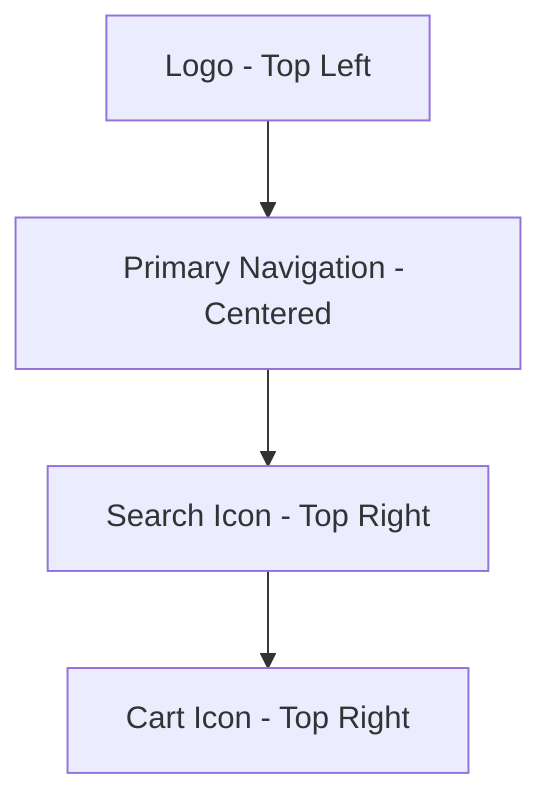
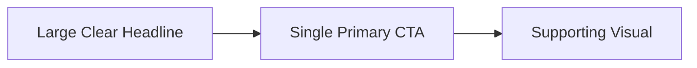
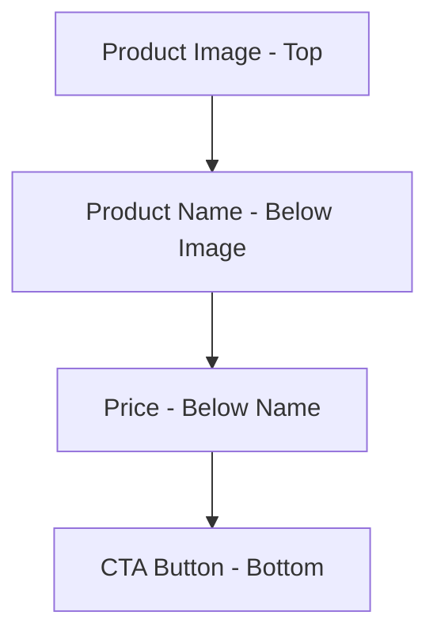
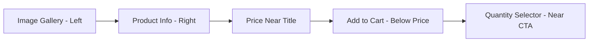
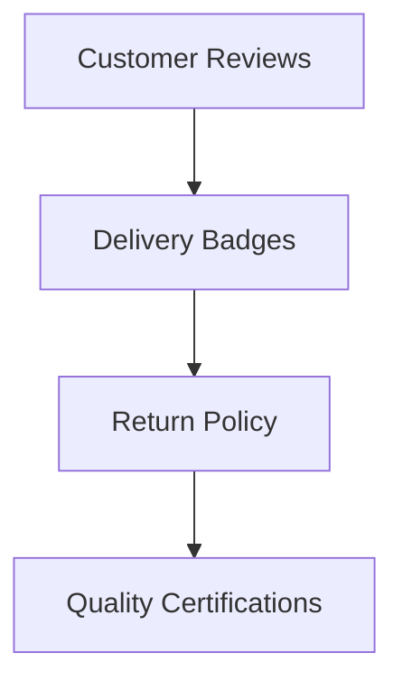
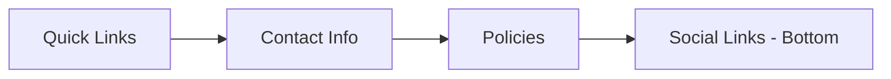

# Jakob's Law-Compliant Website Layout Specification

## Executive Summary

This specification outlines a production-ready UI layout that strictly adheres to Jakob's Law, ensuring users feel instantly familiar with minimal learning effort. The design follows established e-commerce patterns while maintaining Sunya's premium brand identity.

## Jakob's Law Compliance Principles

### Core Principles Applied:

- **Familiarity Over Creativity**: Users spend most time on other sites, so our UI must match their existing mental models
- **Recognition Over Recall**: Information and actions should be visible and self-evident
- **Consistency Across Platforms**: Maintain the same mental model from desktop to mobile
- **Industry Standard Placements**: Follow common e-commerce conventions

## Layout Specification

### 1. Header (Standard E-commerce Pattern)



**Implementation Details:**

- Logo positioned top-left (current implementation: ✓)
- Primary navigation centered with standard labels: Home, Shop, About, Contact (current: Products, Subscribe, Retailers, About)
- Search icon and cart icon top-right (current: ✓)
- Mobile: Hamburger menu for navigation (current: ✓)

**Required Changes:**

- Rename "Products" to "Shop" for broader familiarity
- Add "Contact" to primary navigation
- Ensure search bar follows standard placement patterns

### 2. Hero Section (Conversion-Focused)



**Implementation Details:**

- Large, benefit-driven headline (current: ✓)
- Single primary CTA button "Shop Now" or "Explore Products" (current: "Explore Collection")
- Familiar left-text, right-image layout (current: ✓)
- Trust signals (100% Pure, 0 Additives, Export Grade) positioned below CTA

**Required Changes:**

- Standardize CTA button text to "Shop Now" for maximum familiarity
- Ensure headline follows "Benefit + Product" format
- Maintain visual hierarchy: Headline > Subheadline > CTA > Trust signals

### 3. Product Listing (Grid-Based E-commerce Standard)



**Implementation Details:**

- Grid layout: 2 columns (mobile), 3 columns (tablet), 4 columns (desktop)
- Consistent card design with hover states
- Product image aspect ratio: 1:1 (square)
- Price display: Bold, prominent, near product name
- Primary CTA: "Add to Cart" button (current: ✓)
- Secondary CTA: "Buy Now" button (current: ✓)

**Required Changes:**

- Standardize card padding and spacing
- Ensure consistent hover effects across all product cards
- Add quick view functionality (modal) for advanced users

### 4. Product Detail Page (Industry Standard)



**Implementation Details:**

- Image gallery with thumbnails (left 50% width)
- Product information (right 50% width)
- Price positioned immediately below product title
- Primary CTA "Add to Cart" placed below price information
- Quantity selector positioned adjacent to CTA button
- Trust signals: Reviews, delivery info, return policy below CTA

**Required Changes:**

- Implement standard image gallery with zoom functionality
- Add product variant selector (if applicable)
- Include delivery estimate calculator
- Add social sharing buttons

### 5. Trust & Familiarity Signals



**Implementation Details:**

- Star ratings with review count below product info
- Delivery badges: "Free Shipping", "Fast Delivery", "Secure Checkout"
- Return policy: "30-Day Returns", "Money Back Guarantee"
- Quality certifications: "Export Grade", "Lab Tested", "100% Natural"

**Required Changes:**

- Add review summary section on product detail pages
- Implement trust badge carousel in footer
- Add security seals near checkout buttons

### 6. Footer (Expected Placement)



**Implementation Details:**

- Quick links: Products, About, Contact, FAQ
- Contact information: Phone, email, address
- Policies: Shipping, Returns, Privacy, Terms
- Social media icons at bottom (current: ✓)
- Copyright and legal information

**Required Changes:**

- Reorganize footer sections for better visual hierarchy
- Add newsletter signup with clear value proposition
- Include payment method icons

### 7. Interaction & Behavior Patterns

**Button States:**

- Default: Solid color with clear label
- Hover: Slight color darkening + subtle shadow
- Active: Color darkening + inset shadow
- Disabled: Reduced opacity with cursor change

**Navigation Patterns:**

- Breadcrumb navigation on product detail pages
- Back button on checkout pages
- Sticky header on scroll
- Mobile bottom navigation bar

**Form Patterns:**

- Clear field labels above inputs
- Inline validation with helpful error messages
- Auto-format phone numbers and credit cards
- Password strength meters

### 8. Responsive Consistency

**Desktop (>1024px):**

- Full navigation menu visible
- Sidebar filters on product pages
- Multi-column product grids

**Tablet (768-1024px):**

- Condensed navigation
- 2-3 column product grids
- Sticky sidebar filters

**Mobile (<768px):**

- Hamburger menu navigation
- Single column product grid
- Sticky bottom CTA bar
- Thumb-friendly touch targets (minimum 48x48px)

## Implementation Roadmap

### Phase 1: Header & Navigation Standardization

- [ ] Update navigation labels to match industry standards
- [ ] Ensure logo positioning and sizing follows conventions
- [ ] Standardize search and cart icon placement
- [ ] Implement mobile navigation best practices

### Phase 2: Product Listing Optimization

- [ ] Standardize product card layout and spacing
- [ ] Implement consistent hover and focus states
- [ ] Add quick view functionality
- [ ] Optimize grid responsiveness

### Phase 3: Product Detail Page Enhancement

- [ ] Implement standard image gallery with zoom
- [ ] Add variant selection interface
- [ ] Include delivery estimate calculator
- [ ] Add social sharing functionality

### Phase 4: Trust & Conversion Optimization

- [ ] Implement review system with star ratings
- [ ] Add trust badges throughout checkout flow
- [ ] Include security seals and certifications
- [ ] Add urgency indicators (low stock, limited time)

### Phase 5: Footer & Legal Compliance

- [ ] Reorganize footer sections for better UX
- [ ] Add newsletter signup with clear CTA
- [ ] Include payment method icons
- [ ] Ensure all legal links are accessible

## Technical Implementation Notes

### Component Structure

```
components/
├── header/
│   ├── Header.tsx (main header)
│   ├── MobileNav.tsx (mobile navigation)
│   └── SearchBar.tsx (search functionality)
├── product/
│   ├── ProductCard.tsx (grid item)
│   ├── ProductDetail.tsx (detail page)
│   └── ProductGallery.tsx (image gallery)
├── trust/
│   ├── ReviewStars.tsx
│   ├── TrustBadges.tsx
│   └── SecuritySeals.tsx
└── footer/
    ├── Footer.tsx (main footer)
    ├── NewsletterSignup.tsx
    └── SocialLinks.tsx
```

### Responsive Breakpoints

```css
/* Tailwind breakpoints - maintain consistency */
@media (min-width: 640px) {
  /* sm */
}
@media (min-width: 768px) {
  /* md */
}
@media (min-width: 1024px) {
  /* lg */
}
@media (min-width: 1280px) {
  /* xl */
}
@media (min-width: 1536px) {
  /* 2xl */
}
```

### Accessibility Requirements

- All interactive elements must have proper ARIA attributes
- Minimum color contrast ratio of 4.5:1 for text
- Keyboard navigation support for all functionality
- Screen reader compatibility for all content
- Focus states visible and distinguishable

## Validation & Testing

### Usability Testing Checklist

- [ ] 5-second test: Can users identify the brand and main offering?
- [ ] Navigation test: Can users find products within 2 clicks?
- [ ] Checkout flow test: Can users complete purchase without confusion?
- [ ] Mobile test: All functionality works on touch devices
- [ ] Accessibility audit: WCAG 2.1 AA compliance

### Performance Requirements

- Page load time < 2.5 seconds (mobile)
- Time to interactive < 3.5 seconds
- Lighthouse performance score > 90
- Image optimization with WebP format
- Lazy loading for below-the-fold content

## Success Metrics

### Conversion Metrics

- **Primary**: Add-to-cart rate (target: 8-12%)
- **Secondary**: Product page to checkout conversion (target: 40-60%)
- **Tertiary**: Checkout completion rate (target: 60-80%)

### Engagement Metrics

- Bounce rate < 40%
- Average session duration > 2 minutes
- Pages per session > 3
- Return visitor rate > 25%

### Usability Metrics

- Task completion rate > 90%
- System Usability Scale (SUS) score > 75
- Net Promoter Score (NPS) > 50

## Maintenance & Evolution

### Continuous Improvement Process

1. **Monitor**: Track user behavior with analytics
2. **Analyze**: Identify friction points and drop-offs
3. **Test**: A/B test potential improvements
4. **Implement**: Roll out validated changes
5. **Repeat**: Continuous optimization cycle

### Version Control

- All layout changes documented in CHANGELOG.md
- Visual regression testing before major updates
- User testing for significant layout changes
- Backward compatibility maintained for 2 major versions

## Conclusion

This Jakob's Law-compliant layout specification provides a familiar, intuitive user experience that leverages established e-commerce patterns while maintaining Sunya's premium brand identity. By prioritizing recognition over recall and following industry-standard placements, the design minimizes cognitive load and maximizes conversion potential.

The implementation roadmap ensures a phased approach that allows for testing and validation at each stage, reducing risk while delivering measurable improvements to user experience and business metrics.
