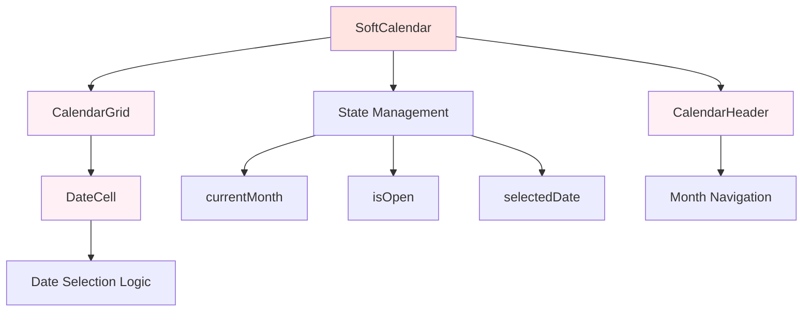

# Soft Calendar UI Component Design Specification

## Overview
Design and implement a custom soft calendar UI component to replace the basic HTML date input in the gifting form. The calendar should embody a private, gentle, emotionally intelligent tone aligned with the "Cravings & Care Cycle™" ethos of quiet, compassionate care.

## Component Structure

### SoftCalendar Component
- **Location**: `components/ui/soft-calendar.tsx`
- **Props**:
  - `selectedDate?: Date` - Currently selected date
  - `onDateSelect: (date: Date) => void` - Callback when date is selected
  - `minDate?: Date` - Minimum selectable date (defaults to tomorrow)
  - `suggestedDates?: Date[]` - Optional dates to highlight as suggestions
  - `className?: string` - Additional styling classes

### Internal State
- `currentMonth: Date` - Currently displayed month
- `isOpen: boolean` - Whether calendar dropdown is open

### Sub-components
- `CalendarHeader` - Month/year navigation with gentle arrow buttons
- `CalendarGrid` - 7x6 grid of date cells
- `DateCell` - Individual date button with hover states

## Styling Approach

### Color Palette
- **Background**: `bg-rose-50` (soft rose background matching form)
- **Selected Date**: `bg-warm-peach text-rose-700` (warm peach with rose text)
- **Hover States**: `hover:bg-rose-100` (gentle rose hover)
- **Disabled Dates**: `text-gray-300 cursor-not-allowed` (past dates)
- **Today Indicator**: `ring-1 ring-rose-200` (subtle ring)
- **Suggested Dates**: `bg-rose-100 text-rose-600` (optional highlighting)

### Typography
- **Headers**: `font-semibold text-rose-800` (month/year)
- **Day Labels**: `text-sm font-medium text-rose-600` (Sun, Mon, etc.)
- **Date Numbers**: `text-base font-medium` (date cells)

### Animations & Transitions
- **Fade In/Out**: `transition-opacity duration-200`
- **Hover Effects**: `transition-colors duration-150`
- **Month Navigation**: `transform hover:scale-105 transition-transform duration-150`
- **Selection**: `scale-105 transition-transform duration-100` (subtle bounce)

### Layout
- **Container**: Rounded corners `rounded-lg`, subtle shadow `shadow-sm`
- **Grid**: CSS Grid with 7 columns, auto rows
- **Spacing**: Generous padding `p-4`, cell gaps `gap-1`

## User Interactions

### Date Selection
- Click any future date to select
- Selected date shows visual feedback
- Keyboard navigation (arrow keys, enter to select)
- Escape to close calendar

### Navigation
- Arrow buttons to change months
- Month/year display in header
- Smooth month transitions

### Accessibility
- ARIA labels for navigation buttons
- Keyboard support (Tab, Enter, Escape)
- Screen reader announcements for date selection
- Focus management within calendar

## Integration with Gifting Flow

### Form Integration
Replace the existing date input in `gifting-client.tsx` (line 295) with:
```tsx
<SoftCalendar
  selectedDate={deliveryDate ? new Date(deliveryDate) : undefined}
  onDateSelect={(date) => setDeliveryDate(date.toISOString().split('T')[0])}
  minDate={new Date(Date.now() + 24 * 60 * 60 * 1000)} // Tomorrow
/>
```

### Labeling & Instructions
- **Label**: "When would you like this care to arrive?"
- **Helper Text**: "Choose a date that feels right for delivery. We recommend selecting a date at least 2-3 days ahead for preparation."
- **Compassionate Tone**: Use phrases like "gentle reminder", "thoughtful timing"

### Validation
- Prevent selection of past dates
- Optional: Warn if selected date is too soon (< 48 hours)
- Show delivery timeframes (e.g., "Arrives in 2-3 business days")

## Mobile Responsiveness

### Breakpoints
- **Desktop**: Full calendar grid (280px min width)
- **Tablet**: Compact grid with smaller cells
- **Mobile**: Touch-friendly buttons (44px min touch target)

### Touch Interactions
- Larger tap targets on mobile
- Swipe gestures for month navigation (optional enhancement)
- Prevent zoom on double-tap

## Technical Implementation

### Dependencies
- `date-fns` for date calculations (already installed)
- `lucide-react` for arrow icons
- Tailwind CSS for styling

### Date Logic
- Generate calendar grid for current month
- Disable dates before minDate
- Handle month boundaries and leap years
- Format dates consistently (YYYY-MM-DD)

### Performance
- Memoize calendar grid generation
- Lazy load calendar when opened
- Minimize re-renders with proper state management

## Optional Enhancements

### Suggested Dates
- Highlight dates based on patterns (e.g., weekends for relaxation)
- Provide gentle guidance: "Consider a weekend for maximum comfort"

### Quick Select
- "Tomorrow", "Next Week", "End of Month" buttons
- Preset options for common delivery timelines

### Time Zone Handling
- Display dates in user's local timezone
- Handle DST transitions gracefully

## Testing & Quality Assurance

### Functional Tests
- Date selection works correctly
- Navigation between months
- Disabled dates cannot be selected
- Keyboard accessibility

### Visual Tests
- Colors match theme on all devices
- Animations are smooth and not jarring
- Responsive layout across breakpoints

### User Experience
- Intuitive interaction patterns
- Clear feedback for all actions
- Compassionate messaging throughout

## Mermaid Diagram: Component Architecture



This design specification provides a comprehensive blueprint for creating a soft, emotionally intelligent calendar component that seamlessly integrates with the existing gifting form while maintaining the compassionate tone of the Sunya brand.